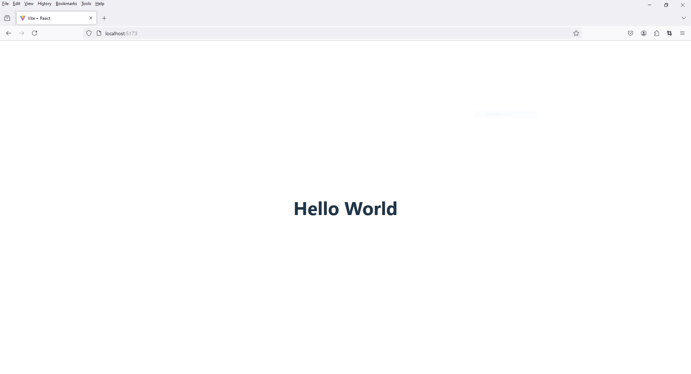

# 2 - Basic Routing
 
1. Commands

```
npm install react-router-dom
```

2. Folder Setup

Folder Setup

```
project_name -> src -> components
```

File Setup

```
project_name -> src -> components -> HelloWorld.jsx
```

3. open `HelloWorld.jsx`

    ```
    import React from 'react'

    function HelloWorld() {
    return (
        <div>
        <h1>Hello World</h1>
        </div>
    )
    }

    export default HelloWorld;
    ```

4. open `App.jsx`

    ```
    import React from 'react'
    import { BrowserRouter, Routes, Route } from 'react-router-dom'
    import HelloWorld from './components/HelloWorld'

    import './App.css'


    function App() {
    return (
        <>
        <div>

            <BrowserRouter>

            <Routes>
                <Route path="/" element={<HelloWorld/>} />
            </Routes>

            </BrowserRouter>

        </div>
        </>
    )
    }

    export default App
    ```

