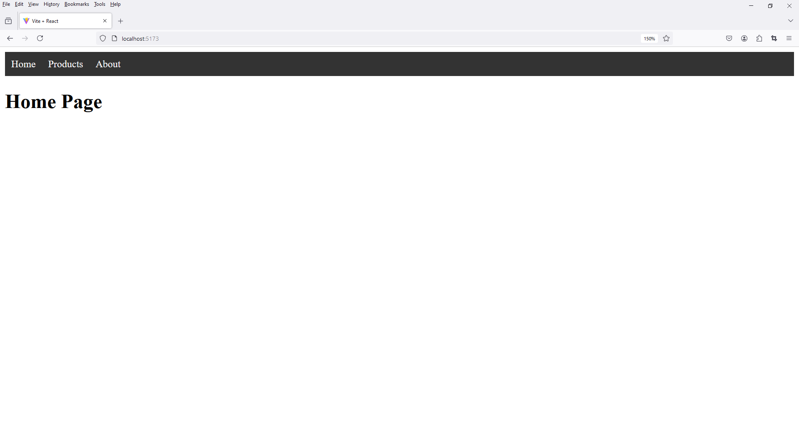
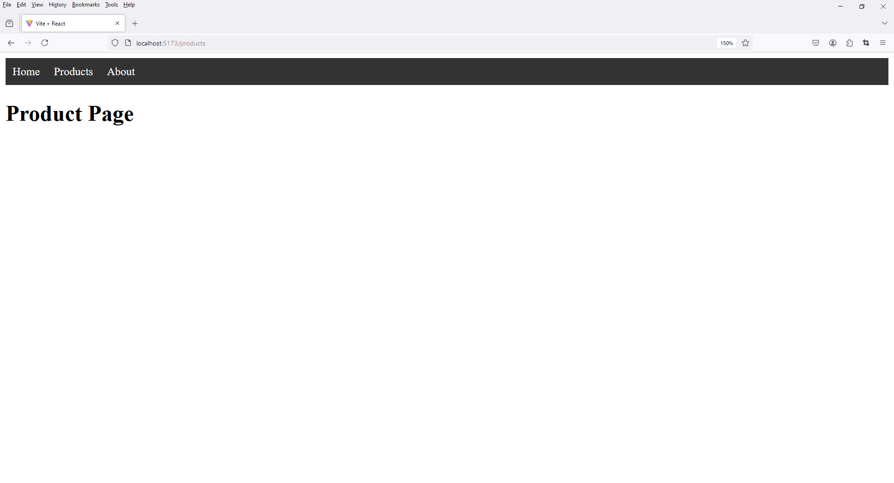
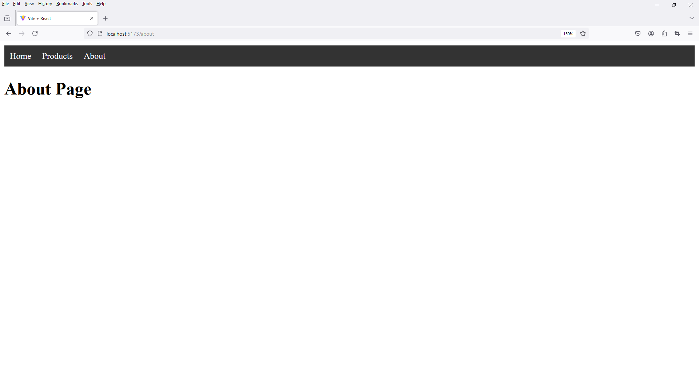

# 3 - Routing With Top Nav Bar
 
1. **Commands**

    ```
    npm install react-router-dom
    ```

2. **Folder Setup**

    Folder Setup

    ```
    project_name -> src -> components
    ```

    File Setup

    ```
    project_name -> src -> components -> TopNavBar.jsx
    ```

    ```
    project_name -> src -> components -> Home.jsx
    ```

    ```
    project_name -> src -> components -> Product.jsx
    ```

    ```
    project_name -> src -> components -> About.jsx
    ```

3. **Notes**

    Clear Content 

    ```
    index.css
    ```

    ```
    app.css
    ```

4. open `TopNavBar.jsx`

```
import React from 'react';
import { Link } from 'react-router-dom'; // Assuming you're using react-router for navigation

function TopNavBar() {
  return (
    <nav style={styles.navbar}>
      <div style={styles.navLinks}>
        <Link to="/" style={styles.link}>Home</Link>
        <Link to="/products" style={styles.link}>Products</Link>
        <Link to="/about" style={styles.link}>About</Link>
      </div>
    </nav>
  );
}

const styles = {
  navbar: {
    display: 'flex',
    justifyContent: 'left',
    backgroundColor: '#333',
    padding: '10px',
  },
  navLinks: {
    display: 'flex',
    gap: '20px',
  },
  link: {
    color: '#fff',
    textDecoration: 'none',
    fontSize: '16px',
  }
};

export default TopNavBar;
```

5. open `Home.jsx`

```
import React from 'react'

function Home() {
  return (
    <div>
      <h1>Home Page</h1>
    </div>
  )
}

export default Home;
```

6. open `Product.jsx`

```
import React from 'react'

function Product() {
  return (
    <div>
      <h1>Product Page</h1>
    </div>
  )
}

export default Product;
```

7. open `About.jsx`

```
import React from 'react'

function About() {
  return (
    <div>
      <h1>About Page</h1>
    </div>
  )
}

export default About;
```

8. open `App.jsx`

```
import React from 'react'
import { BrowserRouter, Routes, Route } from 'react-router-dom'

// import './App.css'
import TopNavBar from './components/TopNavBar'
import Home from './components/Home'
import Product from './components/Product'
import About from './components/About'


function App() {
  return (
    <>
      <div>

        <BrowserRouter>
          <TopNavBar />
          <Routes>
              <Route path="/" element={<Home/>} />
              <Route path="/products" element={<Product/>} />
              <Route path="/about" element={<About/>} />
          </Routes>

        </BrowserRouter>

      </div>
    </>
  )
}

export default App
```





