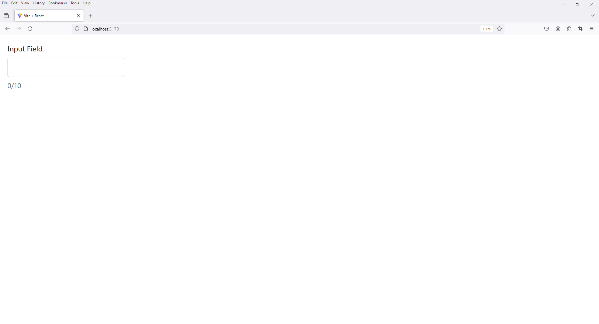
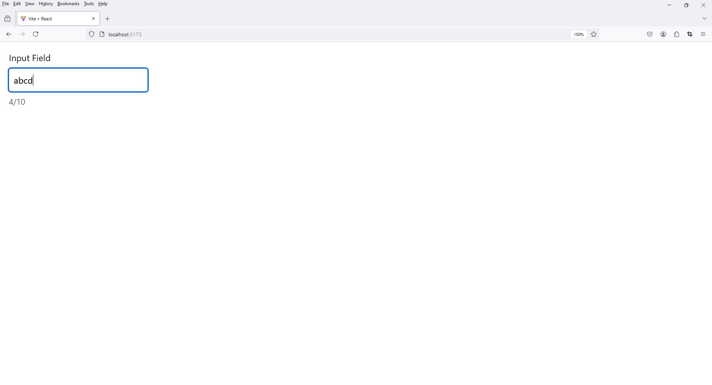

# 5 - Vite React Input Character Count
 
1. Folder Setup

Folder Setup

```
project_name -> src -> components
```

File Setup

```
project_name -> src -> components -> InputWithCount.jsx
```

2. Notes

Clear Content 

index.css

app.css

3. open `InputWithCount.jsx`

```
import React, { useState } from 'react';

const InputWithCount = () => {

  const [inputValue, setInputValue] = useState('');

  const maxCount = 10;

  const handleChange = (e) => {
    setInputValue(e.target.value);
  };

  return (
    <div style={{ margin: '1em' }}>

      <label htmlFor="exampleInput" style={{ display: 'block', marginBottom: '0.5em' }}>Input Field</label>

      <input
        type="text"
        id="exampleInput"
        value={inputValue}
        onChange={handleChange}
        maxLength={maxCount}
        style={{
          padding: '0.5em',
          width: '20%',
          boxSizing: 'border-box',
          border: '1px solid #ccc',
          borderRadius: '4px'
        }}
      />

      <div style={{ marginTop: '0.5em', fontSize: '0.9em', color: '#666' }}>
        {inputValue.length}/{maxCount}
      </div>

    </div>
  );
};

export default InputWithCount;

```



