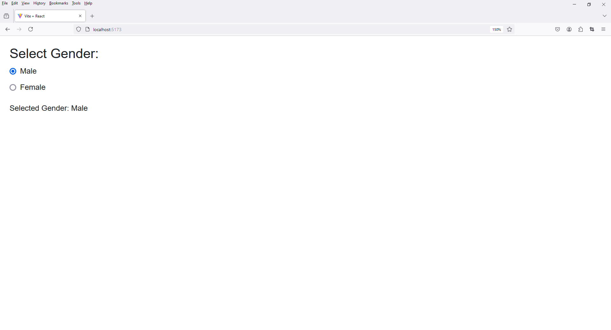

# 6 - Vite React Radio

1. Folder Setup

Folder Setup

```
project_name -> src -> components
```

File Setup

```
project_name -> src -> components -> RadioButtonGroup.jsx
```

2. Notes

Clear Content 

index.css

app.css

3. open `RadioButtonGroup.jsx`

```
import React, { useState } from 'react';

const RadioButtonGroup = () => {

  const [selectedGender, setSelectedGender] = useState('Male');

  const handleGenderChange = (e) => {
    setSelectedGender(e.target.value);
  };

  return (
    <div style={{ margin: '20px', fontFamily: 'Arial, sans-serif' }}>

      <h3>Select Gender:</h3>

      <div>

        <input
          type="radio"
          name="gender"
          id="male"
          value="Male"
          checked={selectedGender === 'Male'}
          onChange={handleGenderChange}
        />

        <label htmlFor="male" style={{ marginLeft: '8px' }}>Male</label>

      </div>

      <div style={{ marginTop: '10px' }}>

        <input
          type="radio"
          name="gender"
          id="female"
          value="Female"
          checked={selectedGender === 'Female'}
          onChange={handleGenderChange}
        />

        <label htmlFor="female" style={{ marginLeft: '8px' }}>Female</label>

      </div>

      <p style={{ marginTop: '20px' }}>Selected Gender: {selectedGender}</p>
      
    </div>
  );
};

export default RadioButtonGroup;
```



