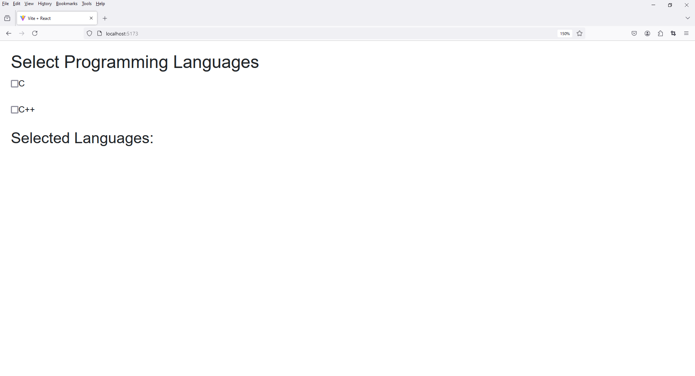
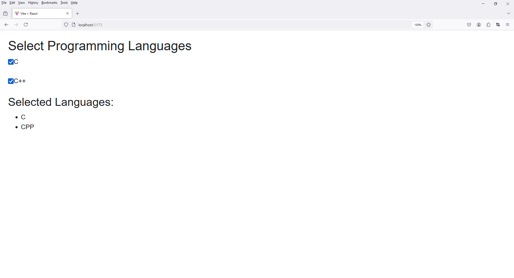

# 7 - Vite React Checkbox
 
1. Folder Setup

Folder Setup

```
project_name -> src -> components
```

File Setup

```
project_name -> src -> components -> CheckboxGroup.jsx
```

2. Notes

Clear Content 

index.css

app.css

3. open `CheckboxGroup.jsx`

```
import React, { useState } from 'react';

const CheckboxGroup = () => {
  const [selectedLanguages, setSelectedLanguages] = useState({
    C: false,
    CPP: false,
  });

  const handleChange = (event) => {
    const { name, checked } = event.target;
    setSelectedLanguages((prevState) => ({
      ...prevState,
      [name]: checked,
    }));
  };

  return (
    <div style={{ margin: '20px', fontFamily: 'Arial, sans-serif' }}>

      <h2>Select Programming Languages</h2>
      
      <label>
        <input
          type="checkbox"
          name="C"
          checked={selectedLanguages.C}
          onChange={handleChange}
        />
        C
      </label>
      
      <br />
      <br />

      <label>
        <input
          type="checkbox"
          name="CPP"
          checked={selectedLanguages.CPP}
          onChange={handleChange}
        />
        C++
      </label>
      
      <br />
      <br />

      <div>
        <h3>Selected Languages:</h3>
        <ul>
          {Object.keys(selectedLanguages).map((key) =>
            selectedLanguages[key] ? <li key={key}>{key}</li> : null
          )}
        </ul>
      </div>
    </div>
  );
};

export default CheckboxGroup;
```



