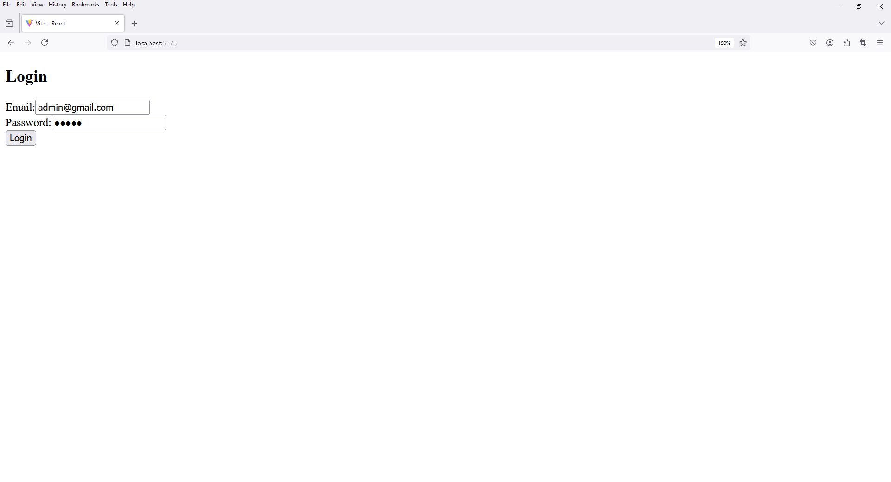
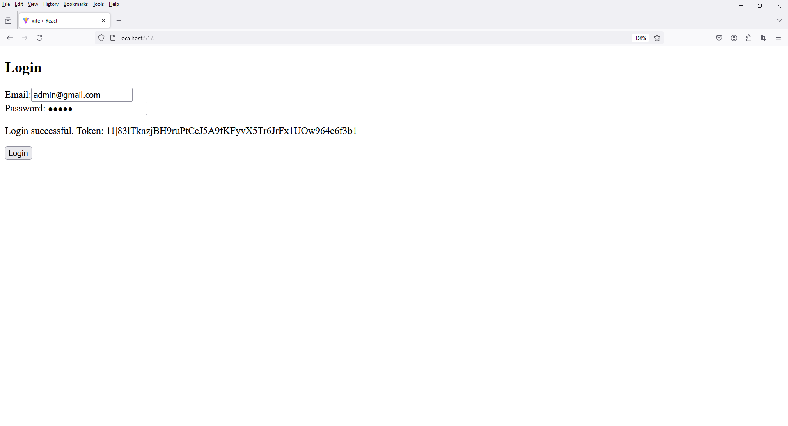
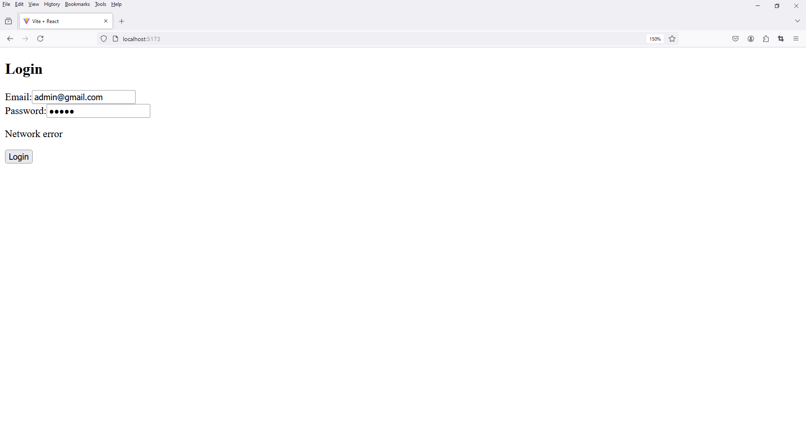

# Laravel Vite Standalone - Login

1. Folder Setup

Folder Setup

```
project_name -> src -> components
```

File Setup

```
project_name -> src -> components -> Login.jsx
```

2. open `Login.jsx`

```
// src/components/Login.jsx
import React, { useState } from 'react';

const Login = () => {
    const [email, setEmail] = useState('admin@gmail.com');
    const [password, setPassword] = useState('admin');
    const [errors, setErrors] = useState({});

    const validate = () => {
        const errors = {};
        if (!email) {
            errors.email = 'Email is required';
        } else if (!/\S+@\S+\.\S+/.test(email)) {
            errors.email = 'Email is invalid';
        }

        if (!password) {
            errors.password = 'Password is required';
        } 
        else if (password.length < 6) {
            errors.password = 'Password must be at least 6 characters';
        }

        return errors;
    };

    const handleSubmit = (e) => {
        e.preventDefault();
        const validationErrors = validate();
        if (Object.keys(validationErrors).length === 0) {
            // Perform login
            console.log('Logged in:', { email, password });
        } else {
            setErrors(validationErrors);
        }
    };

    return (
        <div className="container mt-5">

            <h2>Login</h2>

            <form onSubmit={handleSubmit} noValidate>

                <div className="mb-3">

                    <label htmlFor="email" className="form-label">Email</label>

                    <input
                        type="email"
                        className={`form-control ${errors.email ? 'is-invalid' : ''}`}
                        id="email"
                        value={email}
                        onChange={(e) => setEmail(e.target.value)}
                    />

                    {errors.email && <div className="invalid-feedback">{errors.email}</div>}

                </div>

                <div className="mb-3">

                    <label htmlFor="password" className="form-label">Password</label>

                    <input
                        type="password"
                        className={`form-control ${errors.password ? 'is-invalid' : ''}`}
                        id="password"
                        value={password}
                        onChange={(e) => setPassword(e.target.value)}
                    />

                    {errors.password && <div className="invalid-feedback">{errors.password}</div>}

                </div>

                <button type="submit" className="btn btn-primary">Login</button>

            </form>
            
        </div>
    );
};

export default Login;
```

3. open `App.jsx`

```
import React from 'react'
import { BrowserRouter, Routes, Route } from 'react-router-dom'
import Login from './components/Login'

// import './App.css'


function App() {
  return (
    <>
      <div>

        <BrowserRouter>
          
          <Routes>
              <Route path="/" element={<Login/>} />              
          </Routes>

        </BrowserRouter>

      </div>
    </>
  )
}

export default App
```





